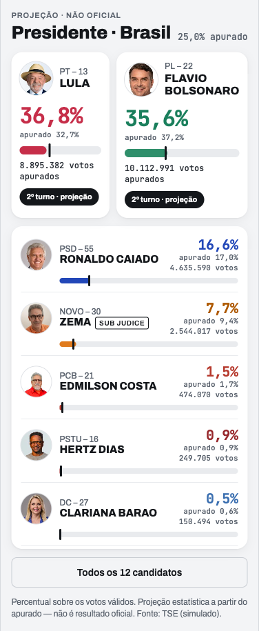

# Protótipo — novo visual da apuração (2026-09-27)

Protótipo do bloco de apuração (lista de candidatos nas bases Parcial e Projeção) feito
**antes** da implementação, a pedido do dono, para escolher o visual. Referência dada por ele:
um app de resultados de prefeito, com os dois primeiros em dois cartões grandes lado a lado,
fontes maiores, design claro e a cor do partido de cada candidato.

**Escopo pedido:** Presidente em todos os níveis (`/` e `/uf/[sigla]`), Governador por estado
(`/uf/[sigla]/governador`) e Senador por estado (`/uf/[sigla]/senador`). As quatro rotas usam
o mesmo `<ResultPanel>` (`components/blocks/ResultPanel.tsx`), que monta as linhas com
`<CandidateResultRow>` (`components/atoms/tables/CandidateResultRow.tsx`).

## ✅ Decisão do dono: versão D

Em 2026-09-27 o dono escolheu a **D · Exemplo com barras**:



- Fundo cinza-claro; cartões com cantos arredondados (16px) e sombra leve.
- **Top 2** em dois cartões lado a lado:
  - foto redonda simples (48px);
  - "PARTIDO – nº" e NOME em caixa alta (16px, peso 800);
  - % grande (32px, mono) na cor de **texto** do partido (`--party-<x>-text`);
  - na Projeção, "apurado X%" pequeno abaixo;
  - barra de 12px;
  - "N votos apurados";
  - selo em pílula escura.
- **Demais** num cartão único, em linhas:
  - foto (44px), "PARTIDO – nº" e NOME em caixa alta (15px);
  - à direita, o % (20px) na cor de texto do partido, "apurado X%" e os votos;
  - barra de 8px na largura toda, abaixo do nome.
- **Barra:** o preenchimento (cor base do partido) é **sempre o apurado**. Na Projeção, uma
  marca preta mostra o projetado. Na Parcial, a marca some.

**Duas decisões do dono tomadas junto com a escolha (2026-09-27):**

1. **"Apurado", "Margem" e a barra de maioria com a marca de 50% FICAM**, acima dos dois
   cartões. É o que o painel já mostra hoje, e o protótipo não tinha.
2. **Presidente na tela do estado (`/uf/[sigla]`) fica SEM selo.** Quem vai ao 2º turno é
   decidido pelo Brasil, não pelo estado. O selo "2º turno" para o 2º colocado de SP diria
   algo falso quando ele é o 3º no país. Na home (`/`) o selo existe. Em Governador e Senador
   por estado, também, porque ali a disputa é do próprio estado.

As outras versões ficam registradas caso a escolha seja revista:

| Versão | Ideia | Imagem |
|---|---|---|
| A · Fiel ao exemplo | Igual à D, mas com anel em volta da foto (arco proporcional ao %) em vez de barra | [versao-A.png](versao-A.png) |
| B · Editorial | Identidade atual (Spectral, mono) ampliada; duelo com números de 40px e barra grossa | [versao-B.png](versao-B.png) |
| C · Placar compacto | Faixa lateral na cor do partido; linhas densas com a cor atrás do nome | [versao-C.png](versao-C.png) |
| E · Barra de corrida | Sóbria, linhas numeradas, legenda, linha tracejada de 50% dos válidos | [versao-E.png](versao-E.png) |

## Regras que as cinco respeitam (valem para a implementação)

- **Base Projeção:** os dois números aparecem, o projetado em destaque e o apurado menor.
  **Base Parcial:** só o apurado. Isso segue o ADR-0029 § 7 e a decisão de 20/09. A ordem, os
  dois destacados e o selo mudam com a base.
- **Cor de partido:** preenchimentos (barra) usam a cor base. Texto usa `--party-<x>-text`,
  porque a cor base reprova contraste em PSOL, PSB, NOVO e Outros (ADR-0047, RNF-022).
- **Selo sempre diz de que base vem.** Nunca "Eleito" ou "Não eleito" soltos (constituição
  § 1; teste `ResultPanelVagas.test.tsx` (h)). O selo aparece só nos dois primeiros; as demais
  linhas não têm selo.
  - **Presidente / Governador:**
    - "2º turno · projeção" ou "2º turno · na parcial" nos dois primeiros;
    - se o líder passa de 50% dos válidos, só nele: "Vence no 1º turno · projeção" ou
      "Venceria no 1º turno · na parcial".
  - **Senador:** "Vaga projetada" ou "Vaga na parcial" (texto do `VagaBadge` atual).
- **Anulado:** vai ao fim, com "—" no lugar do %, só os votos e a barra vazia (ADR-0053,
  opção A). **Sub judice:** etiqueta ao lado do nome.
- **Lista completa:** todos os candidatos ficam na página; "Todos os N candidatos" recolhe e
  expande (ADR-0017, ADR-0034 D21).

## O que o protótipo NÃO decide (fica para a implementação)

- **Número na urna:** é ilustrativo para Governador e Senador, porque o simulado usa ids
  falsos. No payload real, o `id` é o número na urna (ADR-0042).
- **Tema escuro:** o protótipo só tem o claro. A implementação usa os tokens de superfície
  (`--surface-card`, `--surface-page`), e não `#fff`, para o escuro funcionar.
- **Largura:** o protótipo simula 375, 400 e 430px. O site real tem ~352px úteis na coluna do
  desktop (`components/layout/AppShellSplit.module.css`).

## Como abrir e regenerar

- **Abrir:** `index.html` é autônomo (dados embutidos). Abre direto no navegador. As fotos
  vêm do Blob público do site e as fontes do Google Fonts, então precisa de internet.
- **Controles no topo:** versão, tela (Presidente BR / SP, Governador SP, Senador SP), chave
  Parcial / Projeção e largura.
- **Regenerar** depois de mudar `template.html` ou as fixtures, da raiz do repositório:

  ```bash
  python3 docs/design-system/prototipos/apuracao-2026-09-27/gerar.py
  ```

  O script lê só as fixtures de `tests/fixtures/simulacao/` e `app/tokens-party.css`. Não
  toca banco nem rede.

- **Dados:** são os do **simulado** (resultado inventado sobre candidaturas reais). Por isso
  este protótipo **não deve ser publicado** fora do repositório.
