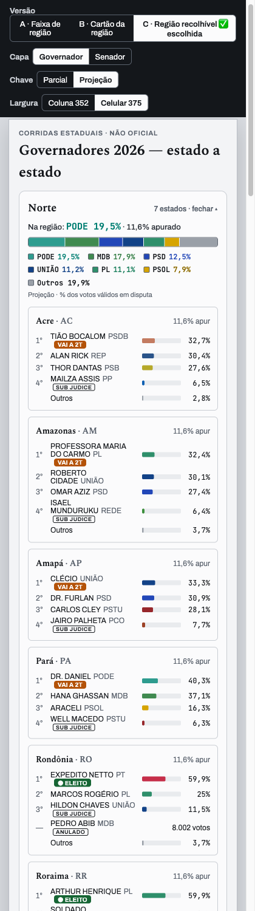

# Protótipo — capas agrupadas por região, com consolidado regional (2026-09-28)

## O pedido do dono

Hoje as capas `/governador` e `/senador` são uma lista alfabética de 27 cartões de estado. O dono
pediu para:

1. **Agrupar por região** — Norte, Nordeste, Centro-Oeste, Sudeste e Sul.
2. **Pôr no topo de cada região o consolidado da disputa** naquela região. É a soma dos votos
   dos candidatos da região, dividida pelo total da região.

Como cada estado tem candidatos diferentes, o consolidado de Governador e de Senado junta os
votos **por partido**. As telas de estado (`/uf/[sigla]/…`) não mudam.

## ✅ Decisão do dono: versão C, com dois ajustes, e a home de Presidente também

- **Região recolhível**, com o cabeçalho sempre visível:
  - o nome da região e "N estados";
  - "Na região: <partido que lidera> X%" e o % apurado da região;
  - uma barra empilhada 100% por partido;
  - a legenda com os percentuais;
  - a base usada ("Projeção · % dos votos válidos em disputa").
- **Botão para abrir e fechar os cartões dos estados.** Os cartões ficam sempre no DOM: fechar
  só recolhe a altura (ADR-0017, ADR-0034 D21).
- **6 partidos + "Outros"**, e não 4. Com 4, o "Outros" da região chegava a 43%.
- **As regiões vêm ABERTAS** quando a página carrega.
- **A home de Presidente (`/`) ganha a mesma seção**, com o consolidado por região e os cartões
  dos 27 estados no formato de `/governador`:
  - ela entra **além** do "Placar por estado" existente, logo antes dele;
  - em Presidente o candidato é o mesmo em todo o país, então o consolidado da região é
    **por candidato**;
  - os cartões de Presidente **não têm selo** de turno. É a regra do ADR-0055: o 2º turno de
    Presidente é fato nacional.

## Outras versões consideradas

- **A · Faixa de região:** cabeçalho da região, barra empilhada e legenda, seguidos dos
  cartões. Ver [versao-A.png](versao-A.png).
- **B · Cartão da região:** o consolidado vira um cartão escuro no formato do cartão de estado
  (1º a 4º partido), com botões no topo da página para pular à região. Ver
  [versao-B.png](versao-B.png).
- **C** com 4 partidos e regiões fechadas: ver [versao-C.png](versao-C.png).

## Regras de cálculo (valem para a implementação)

**Base: votos em disputa.** São os válidos mais os de sub judice; a candidatura anulada fica fora
(ADR-0053). É a mesma base dos cartões de estado. No Senado os percentuais são "dos votos", porque
cada eleitor vota duas vezes.

**Parcial:** soma dos `votos_atuais` de cada candidatura, por partido (ou por candidato, em
Presidente).

**Projeção:** soma do `pct` projetado de cada candidatura vezes o total projetado de votos em
disputa da UF.

- Esse total é um campo **novo** que o produtor passa a emitir por UF. O dono decidiu isso em
  2026-09-28, porque o payload nacional só trazia o %.
- Sem o campo (payload antigo), a Projeção regional mostra "—", nunca uma estimativa.
- **No protótipo** o total projetado é estimado como contado ÷ % apurado. Isso só é exato porque
  o gerador do simulado é uniforme.

**"Outros" da região** junta:

- os partidos além dos 6 maiores;
- a cauda "Outros" de cada estado. O payload nacional só detalha os 4 primeiros de cada UF, então
  esses votos não podem ser creditados ao partido de origem.

**Ordem neutra:** votos em ordem decrescente e, no empate, a sigla em ordem alfabética (pt-BR).

**Filtros de `/governador`:** o consolidado soma **sempre todos os estados da região**. O filtro
só mostra e esconde cartões.

**Conferência feita:** no Sudeste, na Parcial, a soma à mão dos cartões é igual ao consolidado
(PT 25,81%), e o total fecha em 100%.

## Como abrir

`index.html` é autônomo, com os dados das fixtures embutidos. Os controles no topo trocam a
versão, a capa (Governador ou Senador), a chave Parcial / Projeção e a largura. `template.html` é
a fonte do protótipo.
