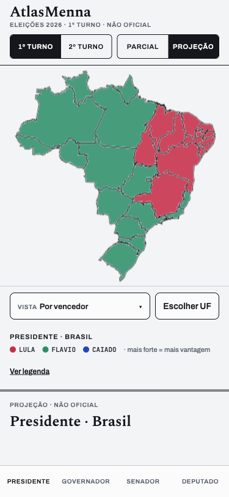
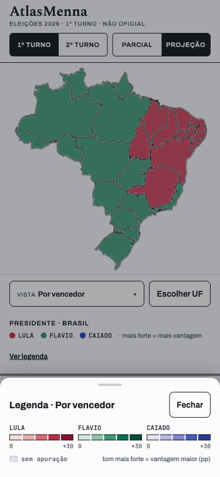

# Protótipo — mapa no celular sem nada por cima (2026-09-27)

No celular (até 959px) o mapa ocupa o topo da página (`52vh`, mínimo 400px,
`components/layout/AppShellSplit.module.css`). Hoje, no mapa de Presidente · Brasil, ficam
**por cima dele**:

- o título do mapa ("PRESIDENTE · BRASIL", que é o `<h2>` da região);
- as 4 vistas ("Por vencedor / Margem / Swing vs 2022 / % apurado", `MapViewToggle`);
- o "Escolher UF" (`UfPicker`);
- a legenda por candidato (`CandidateLegendGroup`, sobreposta no canto inferior
  esquerdo).

Ver [mapa-hoje.png](mapa-hoje.png). O dono pediu para manter todas essas funções e a legenda
**sem cobrir o mapa**.

## ✅ Decisão do dono: versão B, com "Ver legenda"

 

1. **O mapa fica no topo, sem nada por cima.**
2. **Logo abaixo do mapa, uma barra com dois botões de 44px:**
   - **"Vista: <atual> ▾"**, que abre a lista das 4 vistas;
   - **"Escolher UF"**.
3. **Abaixo da barra:**
   - o título do mapa ("PRESIDENTE · BRASIL");
   - a **legenda resumida** numa linha: uma bolinha na cor de cada candidato, com o nome e
     "· mais forte = mais vantagem";
   - o link **"Ver legenda"**, que abre de baixo para cima uma folha com a legenda completa:
     as 5 faixas de cor por candidato, "0 … +30" e "sem apuração". O "Ver legenda" foi um
     pedido do dono em cima da B, emprestado da versão C.
4. **Nas vistas "Swing vs 2022" e "% apurado"** o site não tem legenda hoje. A linha
   resumida diz isso e o "Ver legenda" não aparece. Criar legendas para essas vistas fica
   para depois, se o dono pedir.

**Outras versões consideradas:**

- **A · Faixas acima e abaixo:** título e UF acima; fileira das vistas acima do mapa;
  legenda completa abaixo. Empurra mais a página para baixo. Ver [versao-A.png](versao-A.png).
- **C · Linha única + folha:** uma linha fina acima do mapa com "Vista ▾" e "UF"; legenda
  resumida abaixo; a completa numa folha. É a que dá mais espaço ao mapa. Ver
  [versao-C.png](versao-C.png) e [versao-C-legenda.png](versao-C-legenda.png).

## O que o protótipo não decide (fica para a implementação)

- **Só o celular muda.** No computador (≥960px) a coluna do mapa continua como está, com
  os controles por cima (ADR-0033 § 1).
- **Os outros mapas seguem a mesma ideia:**
  - Governador e Senador · Brasil: a mesma barra, sem legenda de candidatos. É o que o
    site mostra hoje.
  - Mapas de estado: o "← Brasil", hoje flutuando no canto do mapa, vai para a barra ao
    lado do "Escolher UF".
- **Enquadramento:** o mapa hoje reserva folga em cima (até 160px) e embaixo (até 120px)
  para não ficar escondido atrás dos controles. Sem nada por cima, no celular essa folga
  pode encolher e o Brasil aparece maior.
- **O mapa do protótipo é uma imagem parada:** as cores não mudam com a vista.

## Como abrir

`index.html` usa `brasil.png` e `mapa-hoje.png` da mesma pasta. Abra com um servidor local,
porque alguns navegadores bloqueiam imagem em arquivo local:

```bash
python3 -m http.server 3003 --directory docs/design-system/prototipos/mapa-celular-2026-09-27
```

Depois abra `http://localhost:3003`.
